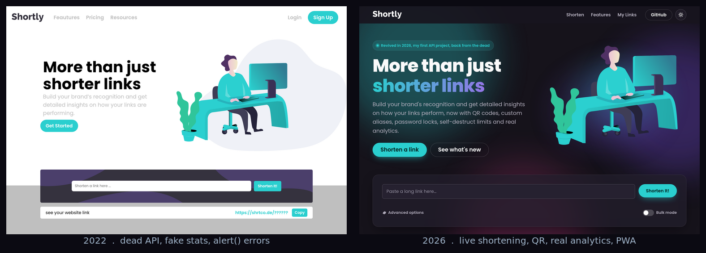
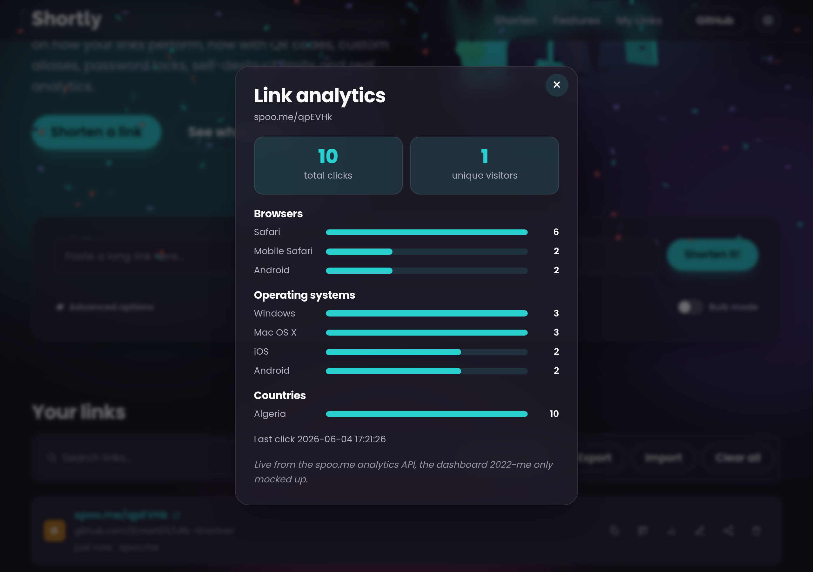

# Shortly, revived

My first ever API project, brought back to life four years later.

Shortly is a link shortener I built in 2022 while I was learning. At some
point its one real feature stopped working, because the API it called shut
down, and I never noticed. For the GitHub Finish-Up-A-Thon I fixed it and
added the things I could not build back then.

This is a submission for the [GitHub Finish-Up-A-Thon](https://dev.to/challenges/github-2026-05-21).
The original 2022 code is preserved on the `v2022-before` tag.

Live demo: https://urlshortner-revival-2026.netlify.app/



## What was broken

The 2022 version was a Frontend Mentor "Shortly" build whose only interactive
feature called `api.shrtco.de`. That service has since shut down, so clicking
"Shorten It!" now fails with `net::ERR_NAME_NOT_RESOLVED` and the user just
sees a misleading `alert("invalid input ... try again!")`. The page also
advertised an "Advanced Statistics" dashboard that never existed.

## What it does now

- Shortens links again, through the [spoo.me](https://spoo.me) API with
  tinyurl as a fallback. Both are key-less and work straight from the browser,
  so there is no backend.
- Custom aliases, like `spoo.me/my-brand`.
- Password-protected links, and links that delete themselves after a set
  number of clicks.
- Real click analytics per link: total and unique clicks, plus bar charts for
  the top browsers, operating systems and countries, pulled live from the API.
  This is the "Advanced Statistics" the original only mocked up.
- QR code for any short link, downloadable as PNG and generated offline.
- A saved history you can search, sort, export to JSON and import back. You
  can also add a short note to any link.
- Bulk mode for shortening several links at once.
- Web Share and one-tap copy.
- Dark and light themes that follow your system setting and are remembered.
- Installable as an app, with an offline app shell via a service worker.
- Keyboard support, focus-trapped dialogs, reduced-motion handling and AA
  contrast in both themes.

## Screenshots



## Tech

It is plain HTML, CSS and JavaScript with no build step. That was the point. I
wanted to write the same stack I used as a beginner and let the difference
show, rather than hide it behind a framework.

- Semantic HTML, CSS custom properties, fluid `clamp()` type, CSS grid, theming
- Vanilla ES modules: `api`, `store`, `qr`, `ui`, `main`
- Web platform APIs: Fetch, Clipboard, Web Share, localStorage,
  IntersectionObserver, Service Worker, Canvas
- spoo.me for shortening and stats, tinyurl as a fallback
- Self-hosted Poppins, and two vendored libraries: qrcode-generator (MIT) and
  canvas-confetti (ISC)
- Built with the help of GitHub Copilot (see the DEV write-up)

## Run it locally

There is no build step. Serve the `public` folder over a local server:

```bash
cd public
python3 -m http.server 8099
# open http://localhost:8099
```

A local server is needed rather than opening the file directly, because the
app uses ES modules and a service worker. It deploys to Netlify as is;
`netlify.toml` publishes `public` at the site root.

## Layout

```
public/
  index.html
  manifest.webmanifest      PWA manifest
  sw.js                     offline app shell
  assets/
    css/   tokens, base, components, app
    js/    api, store, qr, ui, main, boot
    fonts/ self-hosted Poppins
    vendor/ qrcode-generator, canvas-confetti
    icons/
docs/img/                   before and after screenshots
netlify.toml
```

## History

```bash
git checkout v2022-before   # the original 2022 project, as it was abandoned
git checkout main           # the 2026 rebuild (the default branch)
```

Original 2022, revived 2026 by [Okba Allaoua](https://github.com/ELHart05).
